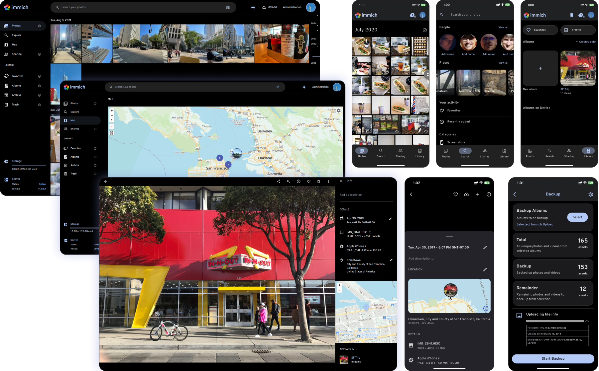

# Immich Custom

基于 [Immich](https://github.com/immich-app/immich) v3.1.0 开发的定制照片管理系统，由 [maxren10](https://github.com/maxren10) 维护，沿用 AGPL-3.0 许可证。

**本仓库包含完整部署源码：Immich Server/Web、内置 JPG/RAW 配对执行器、数据库/缓存/机器学习服务的 Compose 配置。只需克隆本仓库，不需要另行获取 immich-pair 或任何私有项目。**

## 单仓库部署

需要 Docker Compose；初始化可使用本地 Node.js 24，也可通过 Docker 运行。

```sh
git clone https://github.com/maxren10/immich-custom.git
cd immich-custom
docker run --rm -v "${PWD}:/workspace" -w /workspace node:24-bookworm-slim node scripts/setup.mjs
docker compose up -d --build
```

打开 http://localhost:2283 创建管理员，然后创建 API key，保存为一行文本到 `.secrets/api-key`。启用内置配对执行器：

```sh
docker compose --profile pairing up -d --build
```

完整初始化、目录权限、凭据保存、更新和备份说明见 [单仓库部署指南](docs/standalone-deployment.md)。默认使用独立 named volumes，不绑定开发者机器的照片或数据库路径。

## 定制功能

- **JPG/RAW 配对堆叠**：管理任务页面启动或恢复配对，展示进度和人工处理状态；执行器源码位于 [services/immich-pair](services/immich-pair)，支持 JPG/JPEG/ARW/DNG。
- **收藏 RAW 同步**：同步 RAW 原文件；收藏 JPG 时可从堆叠中查找 RAW。
- **记住目标目录**：按用户记忆浏览器目录句柄，支持重新选择和权限失效提示，需要支持 File System Access API 的桌面 Chrome/Edge。
- **副本保护**：SHA-256 校验原始字节，不覆盖内容不同的已有文件；取消收藏后的下次同步只清理未被修改的受管副本，保留无关文件和用户修改的文件。

## 来源与许可证

上游项目：[immich-app/immich](https://github.com/immich-app/immich)。本仓库独立维护，保留上游版权、贡献者及 [GNU AGPL v3](LICENSE) 许可证声明。内置配对执行器也是本定制版的组成部分。下方保留上游项目说明。

---

<p align="center"> 
  <br/>
  <a href="https://opensource.org/license/agpl-v3"></a>
  <a href="https://discord.immich.app">
    
  </a>
  <br/>
  <br/>
</p>

<p align="center">

</p>
<h3 align="center">High performance self-hosted photo and video management solution</h3>
<br/>
<a href="https://immich.app">

</a>
<br/>

<p align="center">
  <a href="readme_i18n/README_ca_ES.md">Català</a>
  <a href="readme_i18n/README_es_ES.md">Español</a>
  <a href="readme_i18n/README_fr_FR.md">Français</a>
  <a href="readme_i18n/README_it_IT.md">Italiano</a>
  <a href="readme_i18n/README_ja_JP.md">日本語</a>
  <a href="readme_i18n/README_ko_KR.md">한국어</a>
  <a href="readme_i18n/README_de_DE.md">Deutsch</a>
  <a href="readme_i18n/README_nl_NL.md">Nederlands</a>
  <a href="readme_i18n/README_tr_TR.md">Türkçe</a>
  <a href="readme_i18n/README_zh_CN.md">简体中文</a>
  <a href="readme_i18n/README_zh_TW.md">正體中文</a>
  <a href="readme_i18n/README_uk_UA.md">Українська</a>
  <a href="readme_i18n/README_ru_RU.md">Русский</a>
  <a href="readme_i18n/README_bg_BG.md">Български</a>
  <a href="readme_i18n/README_pt_BR.md">Português Brasileiro</a>
  <a href="readme_i18n/README_sv_SE.md">Svenska</a>
  <a href="readme_i18n/README_ar_JO.md">العربية</a>
  <a href="readme_i18n/README_vi_VN.md">Tiếng Việt</a>
  <a href="readme_i18n/README_th_TH.md">ภาษาไทย</a>
  <a href="readme_i18n/README_ml_IN.md">മലയാളം</a>
</p>


> [!WARNING]
> ⚠️ Always follow [3-2-1](https://www.backblaze.com/blog/the-3-2-1-backup-strategy/) backup plan for your precious photos and videos!
> 
 

> [!NOTE]
> You can find the main documentation, including installation guides, at https://immich.app/.

## Links

- [Documentation](https://docs.immich.app/)
- [About](https://docs.immich.app/overview/introduction)
- [Installation](https://docs.immich.app/install/requirements)
- [Roadmap](https://immich.app/roadmap)
- [Demo](#demo)
- [Features](#features)
- [Translations](https://docs.immich.app/developer/translations)
- [Contributing](https://docs.immich.app/overview/support-the-project)

## Demo

Access the demo [here](https://demo.immich.app). For the mobile app, you can use `https://demo.immich.app` for the `Server Endpoint URL`.

### Login credentials

| Email           | Password |
| --------------- | -------- |
| demo@immich.app | demo     |

## Features

| Features                                     | Mobile | Web |
| :------------------------------------------- | ------ | --- |
| Upload and view videos and photos            | Yes    | Yes |
| Auto backup when the app is opened           | Yes    | N/A |
| Prevent duplication of assets                | Yes    | Yes |
| Selective album(s) for backup                | Yes    | N/A |
| Download photos and videos to local device   | Yes    | Yes |
| Multi-user support                           | Yes    | Yes |
| Album and Shared albums                      | Yes    | Yes |
| Scrubbable/draggable scrollbar               | Yes    | Yes |
| Support raw formats                          | Yes    | Yes |
| Metadata view (EXIF, map)                    | Yes    | Yes |
| Search by metadata, objects, faces, and CLIP | Yes    | Yes |
| Administrative functions (user management)   | No     | Yes |
| Background backup                            | Yes    | N/A |
| Virtual scroll                               | Yes    | Yes |
| OAuth support                                | Yes    | Yes |
| API Keys                                     | N/A    | Yes |
| LivePhoto/MotionPhoto backup and playback    | Yes    | Yes |
| Support 360 degree image display             | No     | Yes |
| User-defined storage structure               | Yes    | Yes |
| Public Sharing                               | Yes    | Yes |
| Archive and Favorites                        | Yes    | Yes |
| Global Map                                   | Yes    | Yes |
| Partner Sharing                              | Yes    | Yes |
| Facial recognition and clustering            | Yes    | Yes |
| Memories (x years ago)                       | Yes    | Yes |
| Offline support                              | Yes    | No  |
| Read-only gallery                            | Yes    | Yes |
| Stacked Photos                               | Yes    | Yes |
| Tags                                         | No     | Yes |
| Folder View                                  | Yes    | Yes |

## Translations

Read more about translations [here](https://docs.immich.app/developer/translations).

<a href="https://hosted.weblate.org/engage/immich/">

</a>

## Repository activity


## Star history

<a href="https://star-history.com/#immich-app/immich&type=date&legend=top-left">
 <picture>
   <source media="(prefers-color-scheme: dark)" srcset="https://api.star-history.com/svg?repos=immich-app/immich&type=date&theme=dark" />
   <source media="(prefers-color-scheme: light)" srcset="https://api.star-history.com/svg?repos=immich-app/immich&type=date" />
   
 </picture>
</a>

## Contributors

<a href="https://github.com/immich-app/immich/graphs/contributors">
  
</a>
